# 🏦 Banking Fraud ML Detection

> Production-grade fraud detection system for banking transactions — built by a fintech engineer turned ML engineer.

[](https://www.python.org/)
[](tests/)
[](LICENSE)

---

## What This Is

A fraud detection ML pipeline that demonstrates:
- **Domain expertise**: Realistic banking transaction patterns (velocity checks, merchant risk, behavioral baselines)
- **ML engineering**: Three-model comparison with proper imbalanced-dataset handling
- **Production thinking**: Threshold optimization for business cost, not just accuracy
- **Evaluation discipline**: AUPRC over AUC-ROC for imbalanced classes, cost-based threshold selection

Built as part of a portfolio transition from 15+ years of Java/banking to senior ML engineering.

---

## Results

| Model | Precision | Recall | F1 | AUPRC | Net Value |
|-------|-----------|--------|-----|-------|-----------|
| **XGBoost** | **1.000** | **0.800** | **0.889** | **0.867** | **€1,200** |
| Random Forest | 0.421 | 0.800 | 0.552 | 0.790 | €1,178 |
| Logistic Regression | 0.068 | 0.500 | 0.119 | 0.436 | -€138 |

> **Net Value**: (Fraud caught × avg €200 transaction) - (Missed fraud × €200) - (False alerts × €2)  
> **AUPRC** (Area Under Precision-Recall Curve) is the primary metric for imbalanced fraud detection.

**Key insight**: XGBoost achieves zero false positives at 80% recall — meaning every fraud flag is real fraud, while catching 4 out of 5 fraud attempts.

---

## Architecture

```mermaid
graph TD
    A[Raw Transactions] --> B[Synthetic Data Generator]
    B --> C[Temporal Train/Test Split]
    C --> D[Feature Engineering]
    D --> E1[Logistic Regression]
    D --> E2[Random Forest]
    D --> E3[XGBoost ★]
    E1 --> F[Evaluator]
    E2 --> F
    E3 --> F
    F --> G[Threshold Optimizer]
    G --> H[Best Model Saved]
    H --> I[Inference API]

    subgraph "Feature Engineering"
        D --> D1[Amount Deviation\nfrom customer baseline]
        D --> D2[Velocity Features\n1d / 3d / 7d windows]
        D --> D3[Geographic Risk\nforeign / high-risk country]
        D --> D4[Time Patterns\nhour sin/cos, night flag]
        D --> D5[Merchant Risk Score]
    end

    subgraph "Imbalanced Data Handling"
        E1 --> I1[class_weight=balanced]
        E2 --> I2[class_weight=balanced]
        E3 --> I3[scale_pos_weight=199]
    end
```



---

## Quick Start

```bash
# Clone and install
git clone https://github.com/kevin-bot-openclaw-ops/banking-fraud-ml.git
cd banking-fraud-ml
pip install -r requirements.txt

# Run the full pipeline
python main.py

# Quick demo (10k transactions, ~10 seconds)
python main.py --quick

# Run tests
pytest tests/ -v
```

**No API keys required.** All data is synthetically generated.

---

## Key Design Decisions

### Why Temporal Split (Not Random)?
Random train/test splits **leak future information** into training. For time-series transaction data, we train on past months and evaluate on future months — the way production models are actually validated.

### Why AUPRC Over AUC-ROC?
With 0.5% fraud rate, a model predicting "not fraud" on everything gets 99.5% accuracy and high AUC-ROC. AUPRC focuses on the minority class performance — the thing we actually care about.

### Why Threshold Optimization?
Default threshold (0.5) isn't optimal for fraud. We find the threshold that:
1. Meets minimum recall requirement (catch ≥80% of fraud)
2. Maximizes F1 within that constraint
3. Maximizes net business value (€ saved - €lost)

### The Banking Domain Angle
Feature engineering reflects real banking patterns:
- **Velocity features**: "3 transactions in 1 day is normal; 15 in 1 hour isn't"
- **Amount deviation**: "Customer typically spends €50; this transaction is €5,000"
- **Merchant risk**: "Gift cards and crypto exchanges have 10-20x higher fraud rates than groceries"
- **Geographic patterns**: Cross-border transactions flag higher, specific countries flag higher

---

## Project Structure

```
banking-fraud-ml/
├── main.py                      # Entry point — runs full pipeline
├── requirements.txt
├── src/
│   ├── data_generator.py        # Synthetic banking transaction generator
│   ├── feature_engineering.py   # Behavioral feature extraction pipeline
│   ├── models.py                # LR, RandomForest, XGBoost with fraud tuning
│   ├── evaluator.py             # Metrics, threshold optimization, cost analysis
│   └── pipeline.py              # End-to-end orchestration
├── tests/
│   ├── test_data_generator.py   # 14 tests
│   ├── test_feature_engineering.py  # 12 tests
│   └── test_models.py           # 10 tests
├── models/                      # Saved model artifacts (gitignored)
└── data/
    └── sample/                  # Small sample dataset
```

---

## Interview Talking Points

**"Walk me through your feature engineering choices."**
> Fraud detection is behaviorally driven. A €5,000 transaction isn't inherently suspicious — but it's suspicious if the customer's median spend is €50. I compute per-customer baselines during fit() and generate deviation features in transform(). The velocity windows (1d/3d/7d) catch smurfing and card testing attacks.

**"How did you handle class imbalance?"**
> Three approaches, depending on model: class_weight='balanced' for sklearn models (adjusts loss weights), scale_pos_weight for XGBoost (199x weight for fraud class at 0.5% rate), and threshold optimization post-training. I chose not to use SMOTE here because temporal data ordering matters and synthetic oversampling would violate that.

**"What metric do you optimize for?"**
> AUPRC is the headline metric. But the real answer is business cost: what's the dollar value of catching one more fraud vs. blocking one legitimate customer? I expose this through the threshold optimizer — you tell it "catch 80% of fraud minimum" and it finds the precision-recall trade-off point that maximizes net value.

**"Is this production-ready?"**
> The pipeline structure is. Production additions would be: online learning (fraud patterns drift), model monitoring (feature drift detection), A/B testing infrastructure, explainability layer (SHAP values for compliance), and regulatory reporting (EU PSD2 requires fraud rate reporting).

---

## Dataset

Synthetically generated using domain-realistic parameters:
- **500 customers** with individual behavioral profiles (avg spend, typical hours, home country)
- **50,000 transactions** across 12 months
- **0.5% fraud rate** (realistic for card-not-present fraud)
- **15 merchant categories** with empirically weighted fraud rates
- **Fraud patterns**: large amounts, round numbers, night-time, high-risk countries/merchants

No real customer data. Fully reproducible with `--seed`.

---

## License

MIT — use freely, attribution appreciated.

---

*Part of a portfolio demonstrating AI/ML engineering for financial services.*  
*Author: Jerzy Plocha | [LinkedIn](https://linkedin.com/in/jerzyplocha)*
